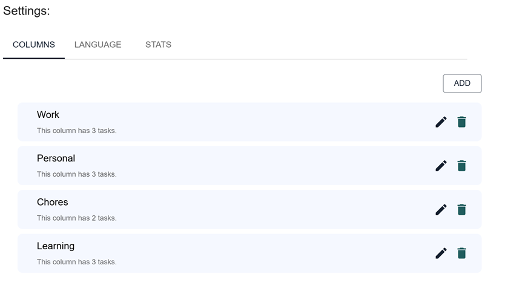
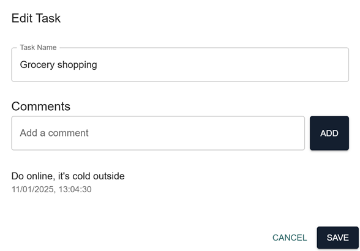
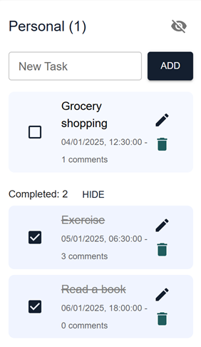
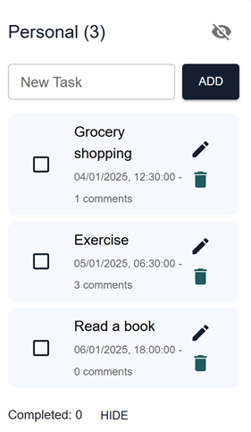
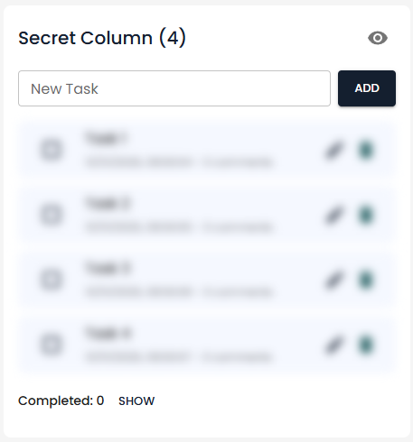
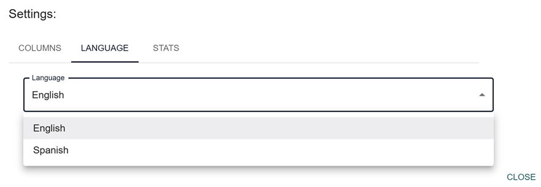
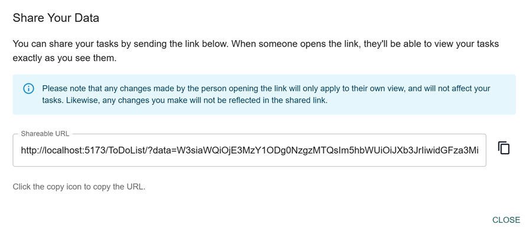
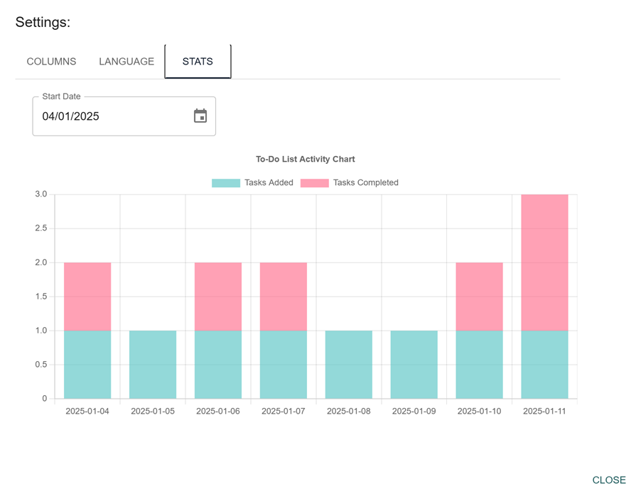

# Simple To-Do Application

A straightforward and efficient to-do application that helps you organize your tasks with ease. Customize your dashboard by creating columns, adding tasks, and managing them effectively. Each task can include comments and be marked as complete. The application also displays a task count indicator for both completed and incomplete tasks in each column.

## Features

### Create custom columns for organizing tasks

### Add comments to individual tasks for better context

### Mark tasks as complete to track your progress

### Task count indicators for completed and incomplete tasks per column

### Columns can be blurred for added privacy

### Multi-Language Support (currently English and Spanish)

### Share your tasks and columns via a generated Data URL

### View your daily completion performance

## Future Enhancements

- **Multi-language Support:** Continue to support more languages and allow in-app switching.
- **Custom Themes:** Allow users to personalize the look and feel through the UI.
- **Data Storage** Update the application to use indexed DB instead of local storage.
- **Edit Task UI** Update the edit task UI as its looking a little plain.
- **App Title Name** Give the ability to change the name of the application that gets displayed in the appbar.
- **Label and Priority** Introduce the ability to add labels onto work items, and set a priority.
- **Task Moving** Tasks can be re-ordered in a single column, but allow support for moving between columns.

---

## Demo

Experience the application firsthand by visiting the deployed version [here](https://ui.joshleatherland.co.uk/).
